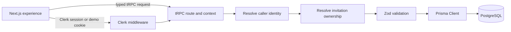

# Jeanty & Trinesha — Wedding Guest Experience

[](https://github.com/Jeanty-Nassau/wedding-website/actions/workflows/ci.yml)
[](https://nassau-wedding.vercel.app/)


I originally built this full-stack application for my own wedding to Trinesha. It was used as a real guest-facing wedding website and became one of my most complete product builds, combining invitation-based RSVP management, meal and dietary selections, relational persistence, responsive design, motion, and deployment.

**Live Demo:** [nassau-wedding.vercel.app](https://nassau-wedding.vercel.app/)

For this public portfolio edition, I preserved the real couple's identity, original visual design, and personal photography while replacing private guest and account information with fictional demo records. I also strengthened the authorization boundaries, restructured the data model, added PostgreSQL migrations, integration tests, end-to-end coverage, and CI. The couple and wedding are real; public demo guest names, RSVP/account records, and placeholder event logistics are fictional. The real wedding guest list is not connected to this deployment.

## Recruiter Quick Start

1. Open the [live demo](https://nassau-wedding.vercel.app/).
2. Select **Explore Demo**.
3. Navigate to **RSVP**.
4. Edit a fictional guest record and save.
5. Reload to verify the change persisted.

No signup is required for the demo flow.

## Why This Project

This project turns an event website into a concrete full-stack engineering example: the browser can edit RSVP details, but the server decides which invitation owns each guest and validates every update before persistence.

## Engineering Highlights

- Invitation ownership is resolved from Clerk identity on the server.
- The recruiter demo can access only a fixed fictional invitation.
- Guest IDs identify requested records; they never grant access to them.
- Zod validates RSVP rules and Prisma enums constrain stored domain values.
- PostgreSQL migrations, repeatable demo seed data, and authorization integration tests support reliable changes.
- GSAP, Framer Motion, and Lenis provide the existing motion design with explicit lifecycle cleanup.

## Architecture



More detail is in [docs/architecture.md](docs/architecture.md).

## Authentication And Authorization

Clerk authenticates a signed-in caller. The demo route sets an HTTP-only cookie that identifies the public demo mode; server code maps that mode to one fixed invitation ID. The cookie does not carry an invitation ID or establish ownership.

> Authentication identifies the caller. Authorization determines which invitation and guest records that caller may access.

> Client-provided guest IDs identify resources but never establish ownership.

The RSVP router resolves a caller's invitation from the Clerk user ID or the fixed demo identity, then constrains guest reads and writes to that invitation. See [docs/security.md](docs/security.md).

## Data Model

- `Invitation` is owned by an optional unique Clerk user ID or marked as a demo invitation.
- `Guest` belongs to one invitation, with PostgreSQL `RsvpStatus` and `MealChoice` enums.
- Guest updates enforce meal selection for attending guests, disallow meals for declined guests, and cap dietary notes at 500 characters.

## Technology Choices

- **Next.js 14 / React 18:** App Router, server routes, and the existing interactive experience.
- **TypeScript 5.9:** A stable release compatible with this Next.js 14 and ESLint stack. TypeScript 7 was not compatible with the removed `baseUrl` option and the existing Next 14 toolchain, so the project is pinned back to TypeScript 5.9.3.
- **Clerk:** Authentication for invitation owners; demo mode is separately constrained server-side.
- **tRPC and Zod:** Typed API contracts with runtime input validation.
- **Prisma and PostgreSQL:** Relational persistence, database constraints, migrations, and generated client types.
- **Tailwind CSS / Sass:** Existing page styling and component styles.
- **GSAP, Framer Motion, Lenis:** Existing scroll, interaction, and transition effects.
- **Vitest and Playwright:** Domain/API tests and one persisted recruiter workflow.

## Testing Strategy

`npm test` covers RSVP input rules and, when `TEST_DATABASE_URL` is set, server authorization against a real PostgreSQL database. CI provisions an isolated PostgreSQL service and runs both unit and integration tests. The Playwright flow covers demo entry, RSVP editing, save feedback, and reload persistence.

```sh
npm run typecheck
npm run lint
npm test
npm run test:e2e
```

## Run Locally

Prerequisites: Node.js 22 or newer, npm 10 or newer, and a PostgreSQL database you control.

```sh
cp .env.example .env
# Replace DATABASE_URL and Clerk placeholders with local development values.
npm ci
npm run db:generate
npm run db:migrate
npm run db:seed
npm run dev
```

Open `http://localhost:3000`. To run database integration tests, point `TEST_DATABASE_URL` at a separate disposable PostgreSQL database with the migrations deployed. Run `npx playwright install chromium` once before `npm run test:e2e`; the app must be built first because Playwright starts `next start`.

`npm run db:migrate` is the local development workflow. `npm run db:migrate:deploy` applies committed migrations in deployment/CI environments. Existing PostgreSQL databases that predate migration tracking should be reviewed and baselined before running the initial migration.

## Environment Variables

| Variable | Purpose |
| --- | --- |
| `DATABASE_URL` | PostgreSQL connection string used by Prisma. |
| `NEXT_PUBLIC_CLERK_PUBLISHABLE_KEY` | Clerk publishable key used by the client. |
| `CLERK_SECRET_KEY` | Server-side Clerk key; never expose it to browser code. |
| `TEST_DATABASE_URL` | Optional, test-only PostgreSQL URL for authorization integration tests. |

`TEST_DATABASE_URL` is intentionally not part of application environment validation: only the integration test reads it. `NODE_ENV` and `VERCEL_URL` are supplied by the runtime/platform. No demo signing secret is used.

## Deployment And Security

[`vercel.json`](vercel.json) sets Vercel's Build Command to apply committed migrations, ensure the fictional demo records exist, and then run the Next.js production build. Seeding is additive: ordinary deployments preserve recruiter RSVP edits. Configure `DATABASE_URL`, `NEXT_PUBLIC_CLERK_PUBLISHABLE_KEY`, and `CLERK_SECRET_KEY` in the Vercel project, and ensure the database is PostgreSQL. A deploy will fail rather than serve against a missing schema. `.env.example` contains placeholders only, not working credentials.

The demo is intentionally public and writes only fictional demo records. It is not a private invitation system. Do not put real guest data or production secrets in the demo database. See [docs/demo-data.md](docs/demo-data.md) and [docs/security.md](docs/security.md).

## Screenshots

- Landing page: `docs/screenshots/landing-page.png` (placeholder)
- Event experience: `docs/screenshots/event-experience.png` (placeholder)
- RSVP flow: `docs/screenshots/rsvp-flow.png` (placeholder)

## Future Improvements

- Add rate limiting and abuse monitoring for the public demo.
- Add invitation provisioning and account lifecycle workflows.
- Add accessibility and cross-browser checks for the motion-heavy sections.
- Add deployment-backed health checks and database backup/retention policy.
