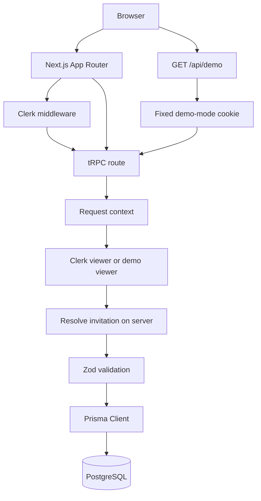

# Architecture

## Request Flow

The Next.js App Router renders the landing, event, and RSVP experiences. Clerk middleware protects private routes and makes signed-in identity available to server code. The public demo route sets an HTTP-only mode cookie; it does not accept an invitation identifier.

The tRPC route creates a request context with the Prisma client and either a Clerk viewer or a demo viewer. The RSVP router resolves the caller's invitation on the server, validates inputs with Zod, and scopes guest reads and writes to that invitation. Prisma persists records in PostgreSQL.

## Data Model

- `Invitation` has an optional unique `clerkUserId`, an `isDemo` marker, and a collection of guests.
- `Guest` references exactly one invitation. The foreign key cascades deletes and `invitationId` is indexed.
- `RsvpStatus` and `MealChoice` are PostgreSQL enums, not free-form text columns.
- Demo invitation and guest IDs are stable so the seed is repeatable and the end-to-end test can address a fictional guest.

The initial migration is in `prisma/migrations/`. `npm run db:migrate` is for local development; `npm run db:migrate:deploy` applies committed migrations in deployment environments. A database that already has tables but no Prisma migration history must be reviewed and baselined before applying the initial migration.

## Environment And Deployment

`src/env.mjs` validates the PostgreSQL URL and required Clerk keys. The committed `vercel.json` Build Command applies committed migrations, restores the fictional demo seed, and then builds Next.js. Configure application secrets in Vercel's environment settings, never in the repository. CI uses an isolated PostgreSQL service and fake Clerk values only.
